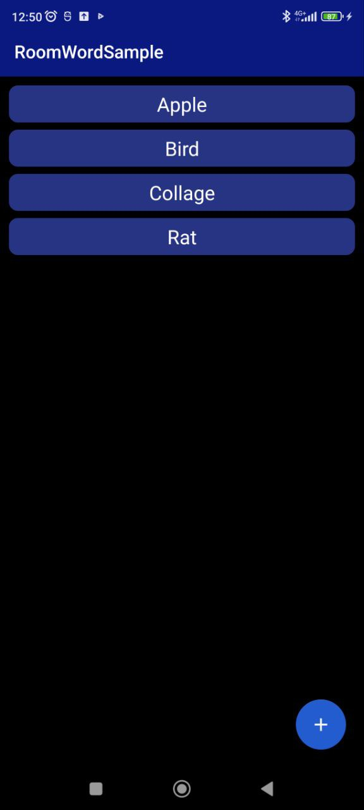
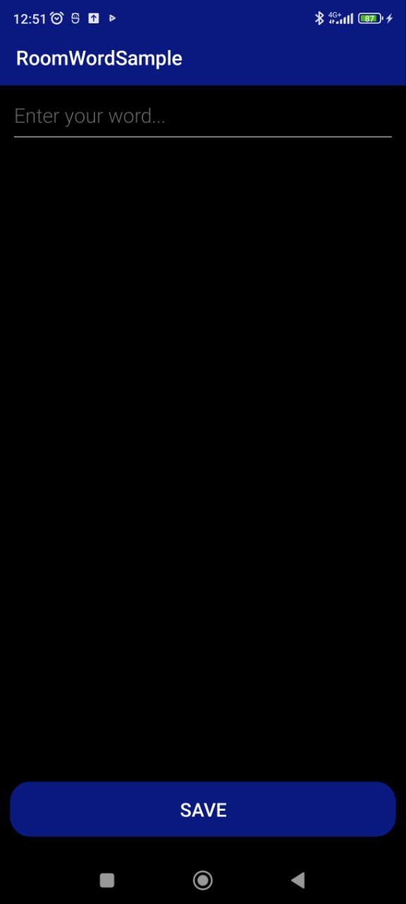

# **RoomWordSample** :books::closed_lock_with_key:
### On this repository you can find an app in which you can add and remove words from the Room database

___
### :warning: The application was created as part of studying the Room database.
### You can use it as a note-taking app

###  How to use:question:
#### Use the app easy-peasy:
1. To add new word click on button at the bottom right,
enter your word, then click the "Save" button and enjoy your new word.
2. If you want to delete some word, just swipe left or right it and the word will disappear.
#### About App:
- #### Supported android versions :hammer:: 9.0 and higher
- #### Memory size :minidisc:: 14 MB
- #### Architectural pattern - MVVM
- #### Russian language support :white_check_mark:
- #### Dark mode support :white_check_mark:

## Application screenshots:

